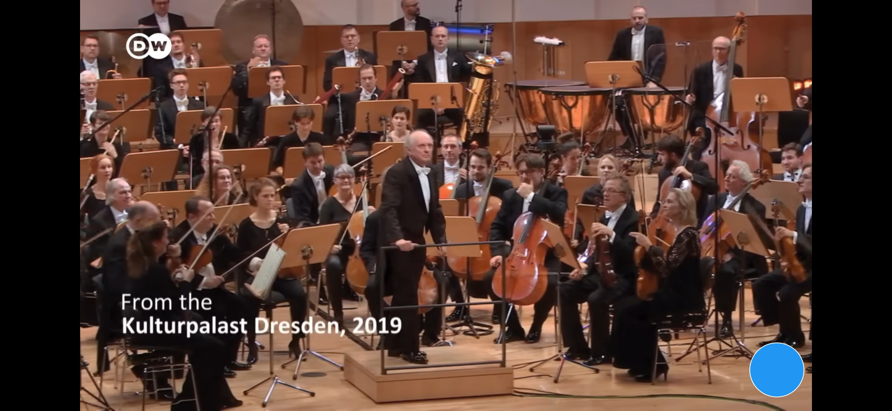

# AssistiPunkt (Assistive Tap)

> **Ihr Tipp-Helfer zur Navigation** – Eine barrierefreie Android-App für intuitive Navigation mit einem schwebendem Punkt

[](https://developer.android.com/)
[](https://kotlinlang.org/)
[](https://developer.android.com/about/versions/oreo)
[](LICENSE)

## 📱 Was macht die App?

Stell dir vor, deine Oma hätte Probleme, die Handy-Tasten unten zu erreichen. Mit diesem kleinen Punkt auf dem Bildschirm kommt sie mit dem Daumen immer wieder nach Hause - egal wo sie gerade ist.

Und weil so ein Punkt praktisch ist, habe ich ihn für Ein-Daumen-Bedienung erweitert:

### Standard-Modus
- **1x tippen** → Home
- **2x tippen** → Zurück
- **3x tippen** → Offene Apps
- **Lang drücken** → Home
- **Verschieben** → Sofort ziehbar

### Safe-Home-Modus (für maximale Sicherheit)
- **Alle Taps** → Home (Oma kommt immer nach Hause)
- **Viereck-Design** → Wie Android-Navigation
- **Lang drücken + Ziehen** → Button verschieben (überall möglich)
- **Geschützt** → Verhindert versehentliches Verschieben

Alles mit einem Daumen, ohne das Handy umzugreifen.

## 🖼️ Screenshots

<p align="center">
  
  
  
</p>

<p align="center">
  <em>Hauptbildschirm • Einstellungen • AssistiPunkt in Aktion</em>
</p>

## 🚀 Installation

### Voraussetzungen
- Android 8.0 (API Level 26) oder höher
- Zwei Berechtigungen erforderlich:
  - **Overlay-Berechtigung**: Für den schwebenden Punkt
  - **Bedienungshilfe-Zugriff**: Für Navigationsaktionen

### Download & Installation

1. APK von [Releases](../../releases) herunterladen
2. APK auf dem Gerät installieren
3. App öffnen und den Anweisungen folgen
4. Berechtigungen erteilen:
   - Overlay-Berechtigung aktivieren
   - "AssistiPunkt" in den Bedienungshilfen einschalten

## 🎮 So funktioniert's

1. **Punkt einschalten**: Schalter in der App aktivieren
2. **Modus wählen**: Standard oder Safe-Home in den Einstellungen
3. **Punkt verschieben**:
   - **Standard-Modus**: Punkt sofort ziehen
   - **Safe-Home-Modus**: Punkt 500ms lang drücken, dann ziehen
4. **Navigieren**:
   - **Standard**: 1x tippen = Home, 2x tippen = Zurück
   - **Safe-Home**: Alle Taps = Home (für maximale Sicherheit)
5. **Anpassen**: Farbe, Durchsichtigkeit und Modus in den Einstellungen ändern

Der Punkt weicht automatisch der Tastatur aus und bleibt auch beim Drehen des Handys an der richtigen Stelle.

## 🛠️ Technische Details

### 🏗️ Architektur

**AssistiPunkt** folgt den **Clean Architecture** Prinzipien mit klarer Trennung der Verantwortlichkeiten:

```
AssistiPunkt/
├── domain/                    # Geschäftslogik & Modelle
│   ├── model/
│   │   ├── DotPosition.kt     # Position-Modell
│   │   ├── Gesture.kt         # Gesten-Enumeration
│   │   └── OverlaySettings.kt # Einstellungen-Modell
│   └── repository/
│       └── SettingsRepository.kt # Daten-Zugriffs-Interface
├── data/                      # Daten-Zugriffsschicht
│   ├── local/
│   │   └── SharedPreferencesDataSource.kt # SharedPreferences-Implementierung
│   └── repository/
│       └── SettingsRepositoryImpl.kt # Repository-Implementierung
├── service/                   # Service-Komponenten
│   └── overlay/
│       ├── OverlayService.kt       # Hauptservice (459 Zeilen - Lifecycle-Management)
│       ├── KeyboardManager.kt      # Tastatur-Vermeidung (273 Zeilen)
│       ├── PositionAnimator.kt     # Positions-Animationen (86 Zeilen)
│       ├── OrientationHandler.kt   # Rotation-Transformationen (97 Zeilen)
│       ├── KeyboardDetector.kt     # Tastatur-Erkennung
│       ├── GestureDetector.kt      # Gesten-Erkennung
│       └── OverlayViewManager.kt   # Overlay-Verwaltung
├── ui/                        # Benutzeroberfläche
│   ├── MainActivity.kt        # Hauptansicht & Berechtigungen
│   ├── SettingsActivity.kt    # Einstellungen
│   └── ImpressumActivity.kt   # Impressum
├── util/                      # Hilfsfunktionen
│   └── AppConstants.kt        # Zentralisierte Konstanten
├── di/                        # Dependency Injection
│   ├── ServiceLocator.kt      # Manuelle DI (ServiceLocator-Pattern)
│   └── AppModule.kt           # Hilt-Modul (für zukünftige Migration)
└── BackHomeAccessibilityService.kt # Accessibility Service
```

### 🧩 Architektur-Prinzipien

- **🧹 Clean Architecture**: Strenge Trennung zwischen Domain, Data und Presentation Layer
- **🔄 Dependency Inversion**: Abhängigkeiten zeigen nur nach innen (Domain)
- **📦 Single Responsibility**: Jede Klasse hat genau eine Verantwortlichkeit
- **🧪 Testability**: Komponenten sind isoliert testbar
- **🔧 Dependency Injection**: Lose Kopplung durch ServiceLocator (bereit für Hilt-Migration)

### 📱 Service-Komponenten

#### OverlayService (Hauptservice)
- **Verantwortlichkeit**: Lifecycle-Management und Komponenten-Orchestrierung
- **Reduziert**: Von 670 auf ~459 Zeilen (31% Reduktion)
- **Pattern**: Composition über Vererbung
- **Rotation Handling**: Intelligente Erkennung mit 16ms Polling

#### KeyboardManager (273 Zeilen)
- **Funktion**: Vollständiges Tastatur-Vermeidungs-Management
- **Features**: Keyboard Detection, Position Adjustment, Snapshot/Restore
- **Debouncing**: Verhindert Position-Flackern
- **Smart Margin**: 1.5x Punkt-Durchmesser Abstand zur Tastatur

#### PositionAnimator (86 Zeilen)
- **Funktion**: Sanfte Positions-Animationen
- **Features**: ValueAnimator-basiert, konfigurierbare Dauer
- **Use Cases**: Drag-End Animation, Edge-Snapping

#### OrientationHandler (97 Zeilen)
- **Funktion**: Bildschirm-Rotation-Transformationen
- **Features**: Mathematische Position-Transformation für alle Rotationen (0°, 90°, 180°, 270°)
- **Smart Detection**: Dynamisches Polling (16ms) bis Dimensionsänderung erkannt wird
- **Zero Jump**: Punkt wird während Rotation versteckt, dann an korrekter Position angezeigt

#### KeyboardDetector
- **Funktion**: Tastatur-Sichtbarkeit und Höhen-Erkennung
- **APIs**: WindowInsets (Android R+), InputMethodManager
- **Fallback**: Heuristische Schätzung bei API-Limitierungen

#### GestureDetector
- **Funktion**: Touch-Gesten-Erkennung und -Verarbeitung
- **Gesten**: Tap, Double-Tap, Triple-Tap, Quadruple-Tap, Long-Press, Drag
- **Timeouts**: System-konforme Timeouts für natürliches Feeling

#### OverlayViewManager
- **Funktion**: Overlay-Erstellung, Positionierung und Darstellung
- **Features**: WindowManager-Integration, Sichtbarkeits-Kontrolle
- **Rendering**: WindowManager mit TYPE_APPLICATION_OVERLAY

### 💾 Daten-Management

#### Reactive Data Flow
- **Kotlin Flows**: Reaktive Datenströme für Echtzeit-Updates
- **SharedPreferences**: Persistente Datenspeicherung
- **Repository Pattern**: Abstraktion der Daten-Zugriffsschicht

#### Einstellungen-Struktur
```kotlin
data class OverlaySettings(
    val isEnabled: Boolean,
    val color: Int,
    val alpha: Int,
    val position: DotPosition,
    val positionPercent: DotPositionPercent,
    val recentsTimeout: Long,
    val keyboardAvoidanceEnabled: Boolean,
    val tapBehavior: String,  // "STANDARD", "NAVI", or "SAFE_HOME"
    val screenWidth: Int,
    val screenHeight: Int,
    val rotation: Int
)
```

### 🔧 Technologie-Stack

- **Sprache**: Kotlin 1.9+
- **Min SDK**: 26 (Android 8.0 Oreo)
- **Target SDK**: 36
- **UI Framework**: Material Design 3
- **Architecture**: Clean Architecture mit ServiceLocator DI
- **Async**: Kotlin Coroutines + Flows
- **Build**: Gradle Kotlin DSL
- **Testing**: JUnit 4 + Mockito (bereit für Erweiterung)

### 📡 Verwendete Android-APIs

- **Overlay API**: `WindowManager.LayoutParams.TYPE_APPLICATION_OVERLAY`
- **Accessibility API**: `AccessibilityService` für System-Navigation
- **WindowInsets API**: Tastatur-Höhen-Erkennung (Android R+)
- **SharedPreferences**: Persistente Konfiguration
- **Gesture Detection**: Custom Touch-Handler mit System-Timeouts
- **LocalBroadcastManager**: Interne Kommunikation (deprecated, geplant: LiveData/Flow)

## ♿ Barrierefreiheit

Die App wurde nach den **WCAG 2.1 Level AA** Richtlinien entwickelt:

- ✅ **Touch-Targets**: Mindestens 48dp, empfohlen 64dp
- ✅ **Kontrast**: Hoher Kontrast für alle UI-Elemente
- ✅ **TalkBack**: Vollständige Screen-Reader-Unterstützung
- ✅ **Große Schrift**: Texte in 16-28sp für bessere Lesbarkeit
- ✅ **Einfache Sprache**: A1-Level Deutsch für maximale Verständlichkeit
- ✅ **Dark Mode**: Automatische Anpassung an System-Theme

##  Entwicklung

### 🚀 Build-Anleitung

```bash
# Repository klonen
git clone https://github.com/Stephan-Heuscher/Back_Home_Dot.git
cd Back_Home_Dot

# Mit Android Studio öffnen
# File → Open → Projektordner auswählen

# Abhängigkeiten synchronisieren
./gradlew build

# Debug-Build erstellen
./gradlew assembleDebug

# Release-Build erstellen (Version wird automatisch erhöht)
./gradlew assembleRelease

# Unit-Tests ausführen
./gradlew testDebugUnitTest
```

#### 🔢 Automatische Versionierung

Release-Builds erhöhen automatisch die Versionsnummer:
- **Version Code**: Wird bei jedem Release-Build um 1 erhöht
- **Version Name**: Patch-Version (letzte Zahl) wird um 1 erhöht
- **Beispiel**: `1.1.0` (Code: 6) → `1.1.1` (Code: 7)

Die Version wird in `version.properties` gespeichert und vor jedem Release-Build aktualisiert.

### 🏗️ Projekt-Struktur & Clean Architecture

Das Projekt folgt **Clean Architecture** Prinzipien:

- **`domain/`**: Reine Geschäftslogik ohne Android-Abhängigkeiten
- **`data/`**: Daten-Zugriffsschicht (Repository-Pattern)
- **`service/`**: Android-Service-Komponenten
- **`ui/`**: Benutzeroberfläche (Activities, Fragments)
- **`util/`**: Hilfsfunktionen und Konstanten
- **`di/`**: Dependency Injection (ServiceLocator + Hilt-Module)

### 🔄 Aktuelle Verbesserungen (v2.0.0)

**Clean Architecture & Komponenten-Refactoring 2025**

- ✅ **Safe-Home-Modus**: Neuer Modus für maximale Sicherheit - alle Taps führen nach Hause
- ✅ **Viereck-Design**: Button wird im Safe-Home-Modus zum Viereck (wie Android-Navigation)
- ✅ **Long-Press Drag**: Im Safe-Home-Modus nur nach langem Drücken verschiebbar
- ✅ **Modus-basiertes Design**: Kreis (Standard/Navi) vs. Viereck (Safe-Home)
- ✅ **Geschütztes Verschieben**: Verhindert versehentliche Bewegung im Safe-Home-Modus
- ✅ **Minimaler Drag-Threshold**: Kurze Drags lösen Home aus, lange Drags verschieben den Button
- ✅ **Architektur-Überarbeitung**: Von monolithischem Service zu komponentenbasierter Architektur
- ✅ **Spezialisierte Komponenten**: Extrahierte KeyboardManager (273L), PositionAnimator (86L), OrientationHandler (97L)
- ✅ **Code-Reduktion**: OverlayService von 670 auf ~459 Zeilen reduziert (31%)
- ✅ **Testbarkeit**: Komponenten sind isoliert testbar
- ✅ **Wartbarkeit**: Klare Trennung der Verantwortlichkeiten
- ✅ **Tastatur-Vermeidung**: Vollständig extrahiert mit optimaler Margin
- ✅ **Rotation ohne Sprung**: Punkt wird während Rotation versteckt, erscheint an korrekter Position
- ✅ **Intelligente Rotation-Erkennung**: Dynamisches 16ms-Polling bis Dimensionsänderung erkannt
- ✅ **Reaktive Daten**: Kotlin Flows für Echtzeit-Updates
- ✅ **Dependency Injection**: ServiceLocator-Pattern (Hilt-ready)

### 🧪 Testing

```bash
# Unit-Tests für alle Module
./gradlew test

# Coverage-Report generieren
./gradlew jacocoTestReport

# Integration-Tests (zukünftig)
./gradlew connectedAndroidTest
```

### 📦 ProGuard & R8

Release-Builds verwenden ProGuard für Code-Optimierung:
- Konfiguration in `app/proguard-rules.pro`
- Clean Architecture sorgt für optimale Obfuscation

### Beitragen

Beiträge sind willkommen! Bitte:
1. Fork das Repository
2. Erstelle einen Feature-Branch (`git checkout -b feature/AmazingFeature`)
3. Committe deine Änderungen (`git commit -m 'Add: AmazingFeature'`)
4. Push zum Branch (`git push origin feature/AmazingFeature`)
5. Öffne einen Pull Request

## 📋 Roadmap

### 🚀 **Abgeschlossen (v2.0.0)**
- ✅ **Clean Architecture**: Vollständige Umstellung auf moderne Architektur
- ✅ **Komponenten-basierte Services**: OverlayService in fokussierte Komponenten zerlegt
- ✅ **Verbesserte Tastatur-Vermeidung**: 1.5x Punkt-Durchmesser Margin
- ✅ **Reaktive Datenströme**: Kotlin Flows für Echtzeit-Updates
- ✅ **Dependency Injection**: ServiceLocator-Pattern (Hilt-ready)
- ✅ **Deprecation Fixes**: Alle veralteten APIs aktualisiert (LocalBroadcastManager, versionCode, etc.)
- ✅ **Tipp-Verhalten Modi**: Standard- und Zurück-Modi implementiert
- ✅ **Dynamische Anweisungen**: Hauptbildschirm zeigt kontextabhängige Anweisungen
- ✅ **Einstellungen-Optimierung**: Tipp-Verhalten an oberste Stelle der Einstellungen verschoben

### 🚀 **Geplante Features**

Die Weiterentwicklung wird durch **Ihr Feedback** gesteuert!

#### 🎯 **Hoch priorisiert**
- **Hilt Migration**: Von ServiceLocator zu Hilt DI
- **Erweiterte Tests**: Unit-Tests für alle Komponenten
- **Performance Monitoring**: Battery- und Memory-Optimierung
- **Accessibility Audit**: Vollständige WCAG 2.2 AA Konformität

#### 💡 **Mögliche Features**
- **Custom Gesten**: Benutzerdefinierte Gesten-Konfiguration
- **Themes**: Dunkles/Licht-Theme für Overlay
- **Animations**: Sanfte Übergänge und Feedback
- **Multi-Device**: Wear OS Companion App
- **Statistics**: Nutzungsstatistiken und Insights
- **Backup/Restore**: Einstellungen sichern/wiederherstellen

### 💬 **Feedback geben**

- **GitHub Issues**: [Neue Anfrage erstellen](../../issues/new)
- **Feature Requests**: Mit "enhancement" Label versehen
- **Bug Reports**: Mit "bug" Label und Reproduktionsschritten

## 🐛 Bekannte Einschränkungen

- **Overlay über System-UI**: Ab Android 8.0 erlaubt Google aus Sicherheitsgründen keine Overlays über System-Einstellungen
- **Akku-Optimierung**: Bei aggressiver Akku-Optimierung kann der Service beendet werden

## 📄 Lizenz

Dieses Projekt steht unter der MIT-Lizenz - siehe [LICENSE](LICENSE) Datei für Details.

## 👤 Autor

**Stephan Heuscher**

- GitHub: [@Stephan-Heuscher](https://github.com/Stephan-Heuscher)

## 🙏 Danksagungen

- Entwickelt mit Unterstützung von Claude (Anthropic)
- Icons von Material Design
- Inspiriert von iOS AssistiveTouch

## 📞 Support

Bei Fragen oder Problemen:
- Öffne ein [Issue](../../issues)
- Kontaktiere den Entwickler über GitHub

---

**Hinweis**: Diese App ist ein Hilfsmittel und ersetzt keine professionelle Beratung oder Therapie bei motorischen Einschränkungen. Konsultiere bei gesundheitlichen Fragen immer einen Arzt oder Therapeuten.

Made with ❤️ for accessibility
